# **Applying Computer Vision and Machine Learning to Measuring Algal Diversity**
**Tristan Pedro** 

## Project Summary

In collaboration with a Master's student specializing in Aquatic Resources from the [Department of Biology](https://www.bio.txst.edu/) at Texas State University (TXST), I received a pivotal dataset obtained through [FlowCam](https://www.fluidimaging.com/) technology. This dataset, crucial to their research on the ["Photobiological Process for Reverse Osmosis Brine Treatment and Minimization"](https://ikehata.wp.txstate.edu/research/232-2/), originates from the [Ikehata Lab](https://ikehata.wp.txstate.edu/research/) within the [Civil Engineering Department](https://www.engineering.txst.edu/programs/civil.html) at TXST. By integrating this meticulously collected data into my analysis, I aim to create an interdiscipliary approach to studying algal diversity.

Leveraging this dataset, my role involves the application of advanced computer vision techniques to sift through, filter, and interpret the intricate patterns present within the algal cells. The objective is to develop a robust machine learning model that not only simplifies the process of cell counting but also enriches our understanding of algal diversity.

Work completed as part of the [DataLab](https://datalab12.github.io/) within the Computer Science Department at TXST.

## Guest Lecture Presentation

This project was presented as a guest lecture in a PhD-level Computer Vision class ([CS 7323](https://cs.txstate.edu/academics/course_detail/CS/7323/)) at Texas State University. The lecture covered the methodologies, challenges, and insights gained from working on this project, aiming to provide an in-depth perspective on applying computer vision techniques to biological data analysis.

The presentation slides used during the lecture are available in this repository for further reference:

- [Presentation Slides (PDF)](./presentation/Presentation-Slides-pdf.pdf)
- [Presentation Slides (PPTM)](./presentation/Presentation-Slides-ppt.pptm)

These materials offer a comprehensive overview of the project's scope, including the preprocessing steps, data analysis techniques, and future directions for machine learning model development.

## Problem Statement 

### Challenge in Aquatic Life Sciences
The manual process of identifying and counting algal cells is both time-consuming and prone to errors. Current methods in aquatic life sciences laboratories rely heavily on visual inspection, which is not only labor-intensive but also introduces a high potential for inaccuracies.

### Opportunity with FlowCam Technology
The use of FlowCam, which provides detailed images and corresponding data of algal cells, presents a significant opportunity for improvement. This technology can revolutionize the cell analysis process by introducing automation, thereby enhancing accuracy and efficiency in research.

### Benchmark and Data Characteristics
- **Benchmark:** The current manual counting method serves as the benchmark for this project. The goal is to surpass this traditional approach in terms of speed and accuracy.
- **Data Source:** The data originates from FlowCam, which captures high-resolution images of algal cells in various cultures, accompanied by data detailing characteristics of each image.
- **Data Characteristics:** The dataset includes a diverse range of algal cell images, varying in shape, size, and color, and is complemented by data providing various features of each image, making the classification task complex yet informative.

### Informal Success Measures
- The project's success will be informally measured by its ability to accurately classify algal species on cross-validated data sets. This means evaluating the model's performance on different subsets of the data to ensure consistency and reliability in its predictive accuracy.

### Project Goals
- The primary objective is to develop a machine learning model that can efficiently classify different algal species or groups, reducing the reliance on manual counting.
- By achieving this, the project hopes to offer a more reliable and efficient method for analyzing algal diversity and behavior in laboratory settings.

### Image Collection Method
- All images in the dataset are captured using FlowCam, a imaging system designed for detailed analysis of particles in fluid, including algal cells.

### Folder Organization
- The dataset is organized into 12 distinct folders. These folders represent different stages and conditions of the experiments, specifically:
  - **Initial:** Baseline images captured at the beginning of the experiments.
  - **2 Weeks (2WK):** Images captured two weeks into the experiments.
  - **4 Weeks (4WK):** Images captured four weeks into the experiments.
  - Each time interval is further categorized into four experimental conditions: 1A, 2A, 1B, and 2B, indicating variations in the experimental setup or treatment.

### Content of Folders
- Each folder contains two types of images:
  - **Original Images:** High-resolution images that capture the detailed morphology of the algal cells.
  - **Binary Images:** Processed images that offer high contrast. In cases of empty cells, a "default" binary image is used.

### Volume of Data
- The dataset contains 50,944 images (+ however many images are in 2WK-2B (error in upload)) and corresponding rows within a .lst file for each image (seperated into 12 individual .lst files based on experiment type (e.g., IN-1A, 2WK-2A, etc.)).

### Corresponding Data
- Alongside the images, each folder includes corresponding data in the form of .lst files. Each .lst file contains 56 columns with various descriptors related to the images.
- The number of rows in each .lst file varies, depending on the number of images captured in each experiment (e.g., IN-1A, 2WK-2A, etc.).
- Due to the unique format of the original data files (".lst"), a custom function has been developed in the "preprocess.ipynb" notebook to convert these files into Pandas DataFrames, then saved as .CSV for easier analysis and processing.

## Exploratory Data Analysis

In this project, a comprehensive Exploratory Data Analysis (EDA) was conducted on algal cell images captured using FlowCam. The EDA focused on applying various computer vision algorithms to understand the characteristics of the images and to refine the preprocessing steps for machine learning models.

### Visualization of Filter Options

The `visualize_filter_options` function was developed to apply different computer vision techniques on the images. This function performs the following operations:

1. **Conversion to Grayscale:** Simplifies the images by reducing them to a single color channel.
2. **Thresholding:** Binary thresholding to separate cells from the background.
3. **Blob Detection:** Identifies and highlights potential algal cells.
4. **Edge Detection:** Canny edge detection to outline the shapes of objects in the images.

These steps were applied to different images representing obvious cells, obvious blanks, potential outliers, and cases where blob detection catches unwanted images. This visualization helps in understanding how different preprocessing techniques affect the images and aids in refining the model.

### Outlier Detection

Outlier detection was performed on various features like image width and height, and average color channels (red, green, blue). Box plots were used to visualize these features, helping to identify outliers in the data.

The `detect_outliers` function was used to identify indices of outliers in these features, which were then visually inspected. This step is crucial in understanding data variability and ensuring the robustness of the model.

This didn't result in much, because the some of the outliers were actual images we would want to evaluate, but it was a valuable test.

### Correlation Analysis

A correlation matrix was computed for the numerical columns of the dataset. This heatmap visualization helps in understanding the relationships between different variables and is instrumental in feature selection for the machine learning model.

### t-SNE Visualization

Two types of t-SNE visualizations were performed:

1. **Naked t-SNE:** To visualize the high-dimensional data in a two-dimensional space, focusing on circularity and convex hull area features.
2. **t-SNE with K-Means Clustering:** Combined t-SNE visualization with K-means clustering to identify distinct groups within the data.

These visualizations assist in understanding the underlying structure of the data and are particularly useful for identifying patterns and clusters.

### Cluster Analysis

Images belonging to specific clusters identified through t-SNE with K-Means were visually inspected. This analysis is critical to ascertain if clusters correspond to meaningful categories, such as cells vs. empty images.

Found that one of the clusters had a large majority of empty images, but there were some missclassified outliers from given K value.

### Image Filtering Algorithm

The project has adopted a custom algorithm for filtering out unimportant cells, primarily utilizing edge detection. This decision was informed by observations made during the `visualize_filter_options` process, where it was noted that the presence and quality of edges in an image are indicative of the cell's significance. 

The algorithm focuses on identifying and retaining images with clear, distinct edges, which are more likely to contain relevant algal cells. Conversely, images with very faint or no edges—often corresponding to empty or less significant cells—are filtered out. However, there are instances where cells (that don't seem signifigant), are present in what are classified as empty images. This raises a question about the threshold of edge clarity needed to classify an image as containing a significant cell.

The current approach is under review to ensure accuracy in classification. If it's determined that some blurry yet relevant cells are being incorrectly filtered out, further refinements and modifications to the algorithm will be explored. This flexibility is key to optimizing the cell classification process and ensuring that the dataset prepared for machine learning models is as comprehensive and accurate as possible.

## Data Preprocessing

### Image Segmentation

- **Initial Challenge:** The raw data provided consisted of sheets of cell images of various sizes. These sheets needed to be processed to isolate each cell image for detailed analysis.
- **Developed Solution:** An algorithm was developed to segment individual cell images from these sheets. This segmentation involved detecting the boundaries of each cell and separating them from the sheet.
- **Resulting Dataset:** Post-segmentation, each cell image was saved as a separate file in designated directories, creating an organized and accessible dataset for further processing.

### Filtering Out Empty Images

- **Idea:** Filtering out images that do not contain relevant cell information, often referred to as "empty" images.
- **Approach:** A custom algorithm using edge detection techniques is being employed to identify and exclude these empty images. The algorithm assesses the presence and quality of edges in an image to determine its relevance.
- **Ongoing Refinement:** This process is continuously being refined to ensure that no significant data is inadvertently filtered out.

### Filtering Out Partial Images

- **Objective:** Target the removal of partial images where only a fragment of a cell is captured, which is a obvious cell that would not be kept for classification.
- **Methodology:** Analyze contours and geometry of objects in each image. Flag images as partial if the detected shapes do not meet predefined criteria of completeness and integrity.
- **Progress and Challenges:** Ensuring the quality of the dataset while avoiding over-filtering remains a challenge. The process is iteratively refined through visual 

### Grouping Images

- **Purpose:** Enhance data organization and aid in more efficient data analysis by grouping similar images, identifying patterns, and commonalities among cell images.
- **Technique:** Used SIFT to compare images based on key features and group similar ones.
- **Implementation and Insights:** Extract features from each image, followed by pairwise comparisons to find matches. This grouping provides insights into the diversity and frequency of specific cell types or shapes in the dataset.
- **Results:** We had some wonderful groupings done by the current implementation algorithm, but there were difficulties, like in aggregate cell images, it shares features with tons of the images, skewing the features matched by a lot.

### Selecting One Image out of Grouping

- **Goal:** Choose a representative image from each group that best exemplifies the characteristics of that group, this is the image that would contribute to the dataset that we would use to train our model.
- **Criteria for Selection:** Select based on criteria like clarity, focus, and the presence of defining features to accurately represent the common features of the group.
- **Process and Benefits:** Algorithmically score each image in a group based on set criteria, choosing the highest-scoring image as the representative. This ensures consistency in the quality of images used for subsequent analysis and modeling.

### Further Future Preprocessing Steps

- **Feature Engineering:** The project will likely involve feature engineering to extract meaningful attributes from the images that can be used for effective classification. This could prove to enhance the features given by the FlowCam.
- **Normalization and Standardization:** As part of preparing the data for machine learning models, normalization and standardization techniques will be applied to ensure that the data is on a consistent scale.
- **Data Augmentation:** To enhance the robustness of the models, data augmentation techniques such as rotations, scaling, and flips may be employed, especially if the dataset size is limited.

## Machine Learning Approaches

### Baseline Evaluation
We can create a simple classification algorithm, such as Logistic Regression or a basic Decision tree to be used as a baseline for later comparisons.

### Potential Machine Learning Methods
We want to choose a classifcation model, and that applies to both the traditional ML family, as well as the DL family (if time permits).
1. **Convolutional Neural Networks (CNNs):**
   - Suitable for image classification tasks due to their ability to capture spatial hierarchies in image data.
   - CNNs can automatically and adaptively learn spatial hierarchies of features from image data.

2. **Support Vector Machines (SVM):**
   - Effective in high-dimensional spaces, making them suitable for image classification where each pixel may be considered a feature.
   - SVMs are also versatile, as they can be equipped with different kernel functions to handle non-linear classification.

3. **Random Forests:**
   - An ensemble learning method that is effective for classification tasks.
   - Random Forests can handle a large number of features and can be used to gauge feature importance, beneficial for understanding which aspects of the algal cells are most distinctive.

Ultimately, I did not get to any machine learning, so I do not have anything else to add to this section besides the potential ML models.

## Experiments 
### t-SNE Visualization with K-means Clusters (K=5)

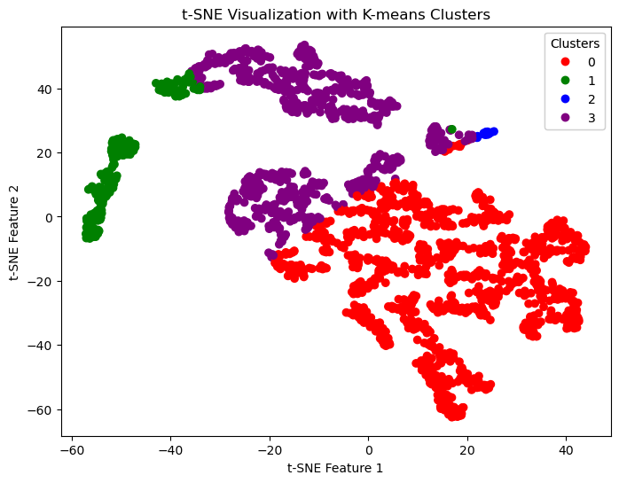

This visualization aids in understanding the distinct clusters within the dataset, which can be used to infer patterns and relationships in algal cell characteristics.

Cluster 1 (Green) was what I referenced earlier as the cluster with dominately "empty" images, but we can see there is some green elsewhere.

### Filter Visualization

#### Cell Images

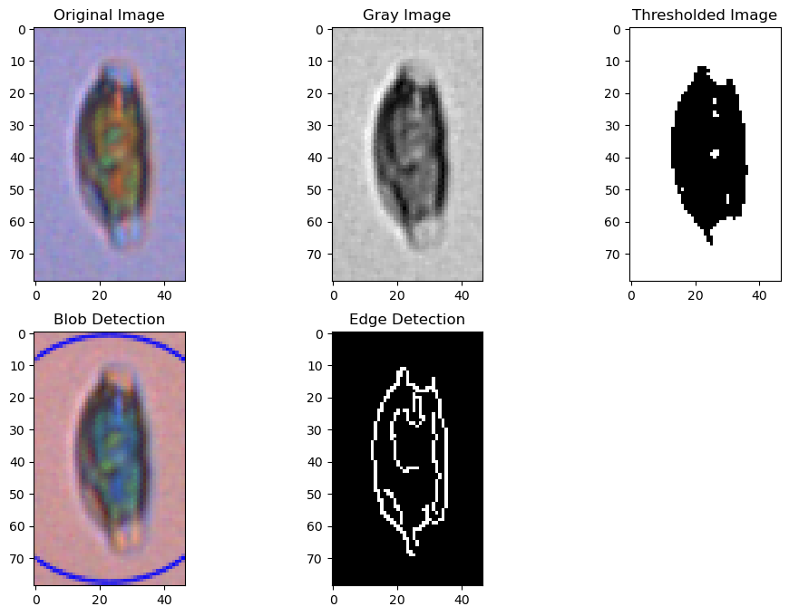

The filters applied to cell images help in identifying the presence of algal cells and their morphological features.

We see that this cell image has edges, so we say it is signifigant.

#### Empty Images

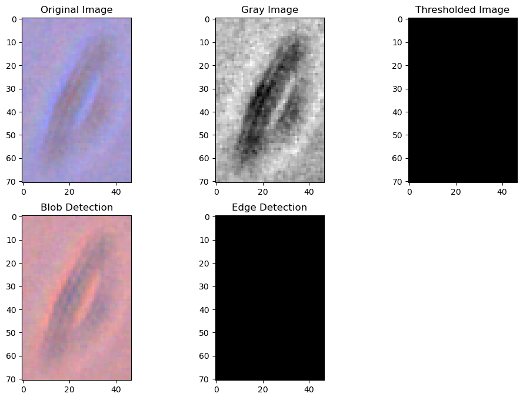

Filtering techniques on images classified as empty are used to validate the absence of significant features and ensure accurate preprocessing.

We see that this cell has no edges, so we say it is "empty".
### Correlation Analysis

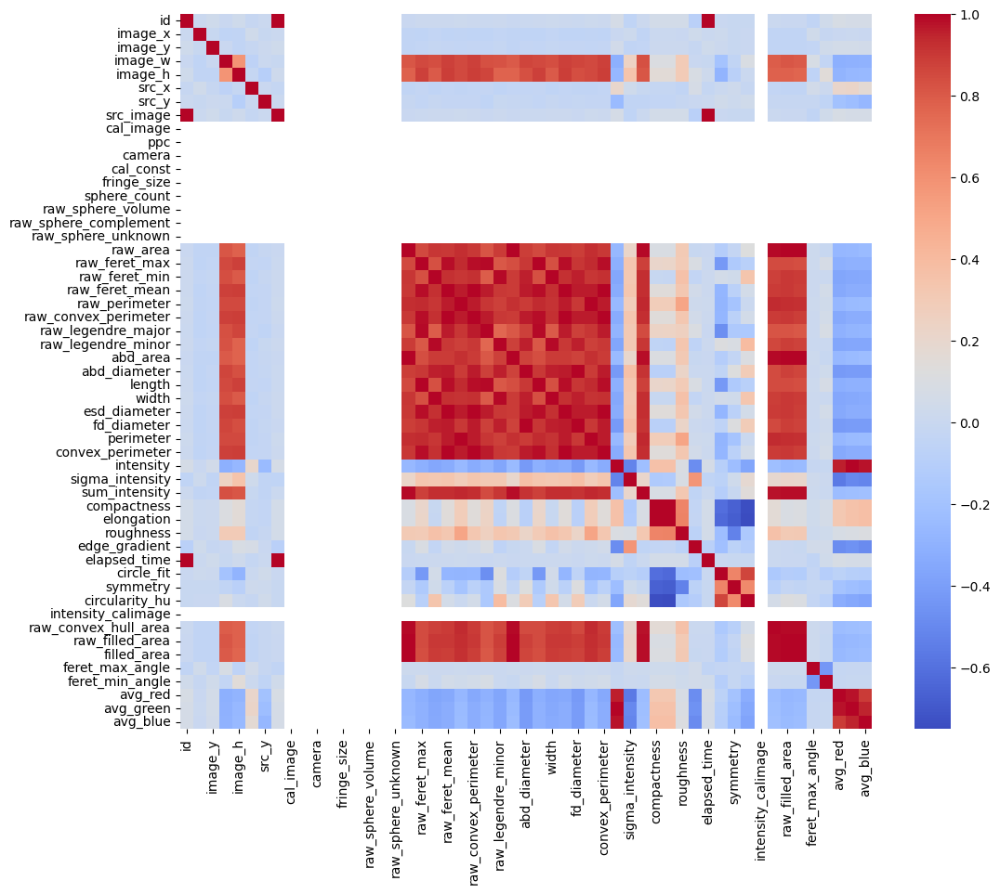

The correlation matrix provides insights into the linear relationships between different features extracted from the images.

### Grouping Function
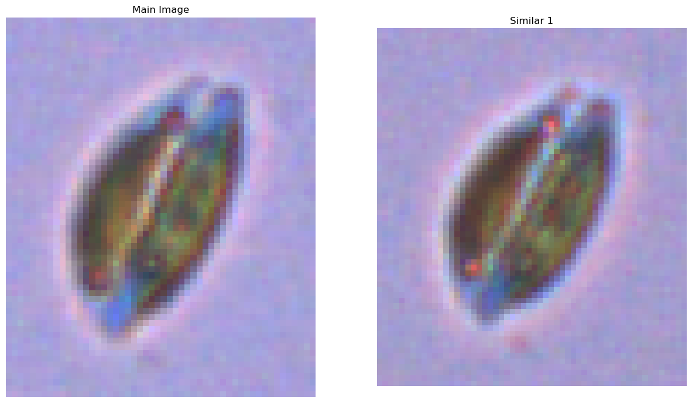
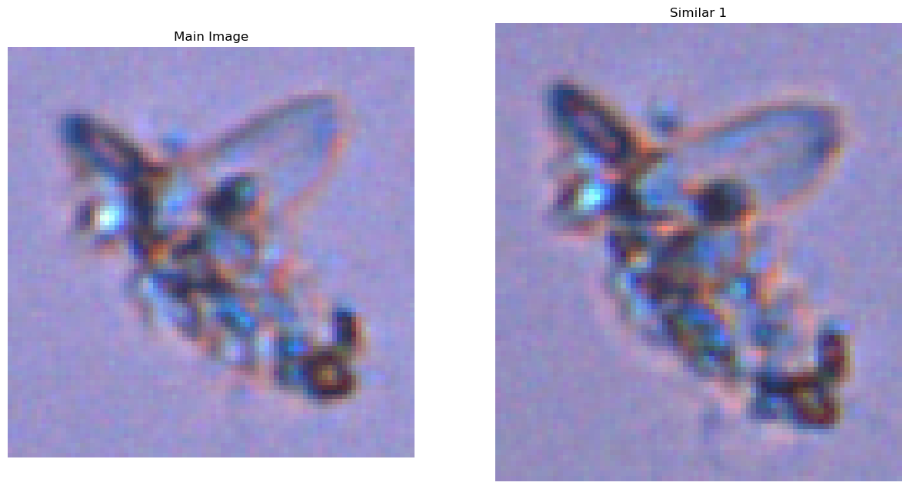
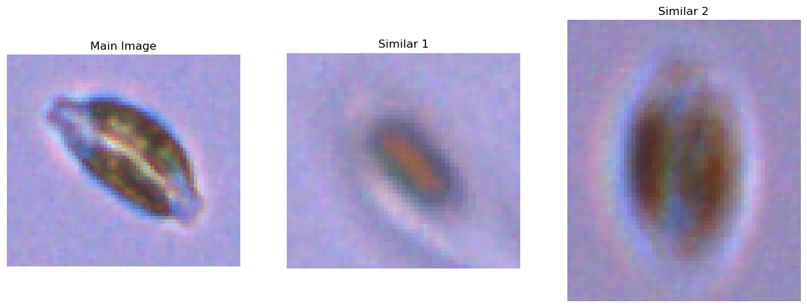

Results from a grouping function that looks for similar images using the SIFT algorithm.

### Looking Deeper Into t-SNE Visualization with K-means Clusters (K=5)

Created function to plot 20 images from each cluster when K=5, and did not determine anything anything super conclusive from the expirement.

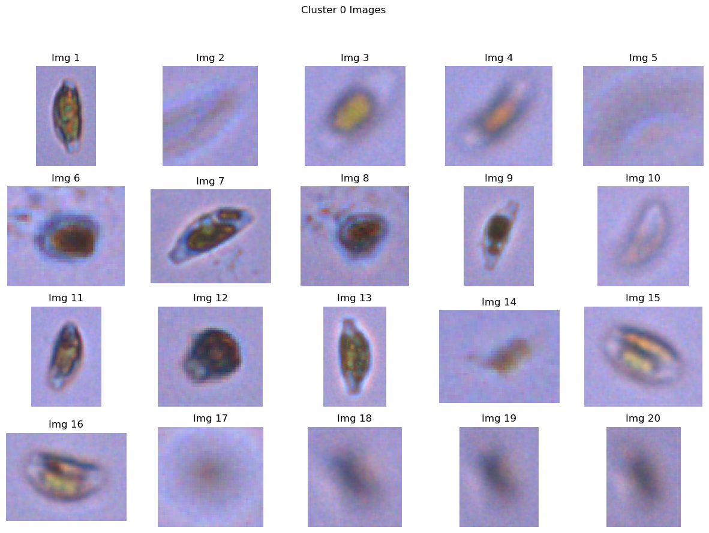
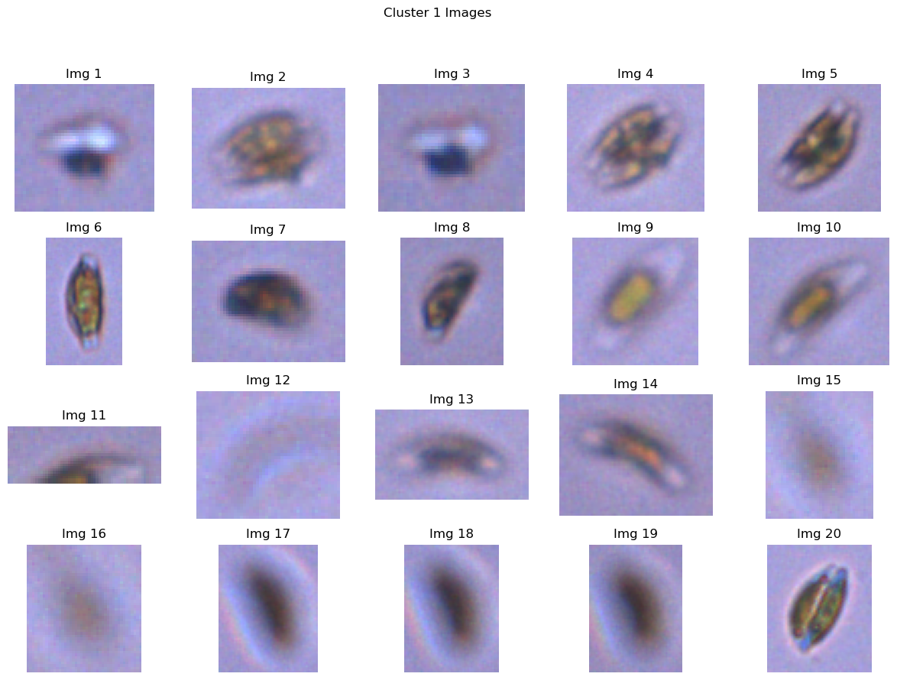
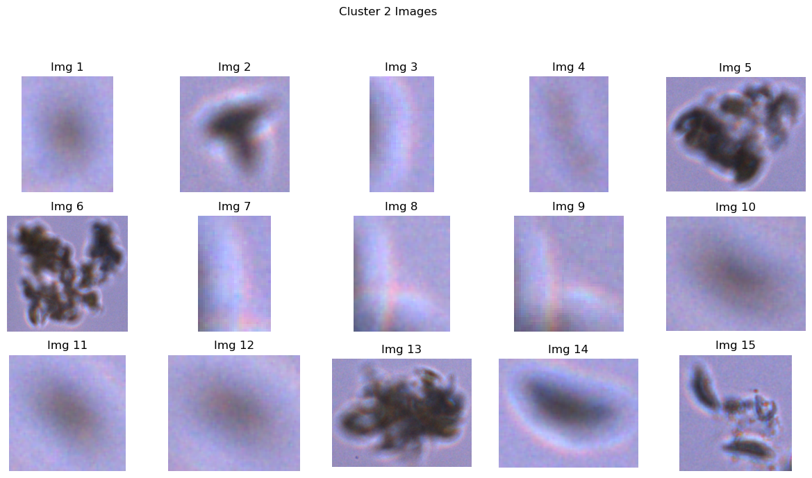
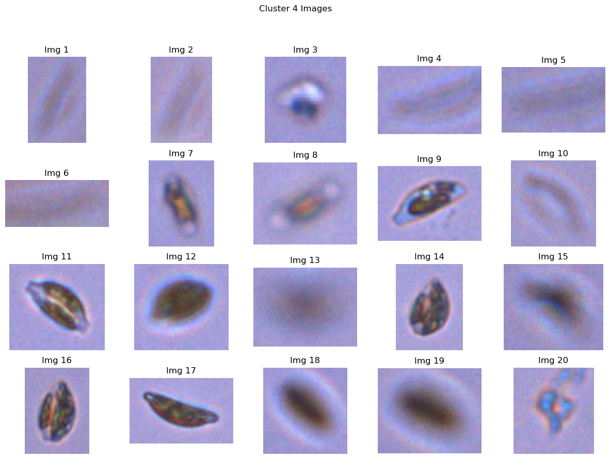

## Conclusion
In the course of this project, a significant effort was dedicated to preprocessing and analyzing algal cell images using FlowCam technology. While the project did not progress to the machine learning phase, the groundwork laid in image preprocessing and data analysis is substantial and forms a solid foundation for future model development. Below are key takeaways and reflections:

### Challenges and Learnings
- **Preprocessing Complexity:** The complexity and volume of the image data necessitated extensive preprocessing, including image segmentation, filtering, and grouping. This process was very time consuming and intricate.
- **Grouping Algorithm Limitations:** The SIFT-based grouping algorithm, although innovative, encountered challenges in accurately grouping aggregate cell images. This led to skewed feature matching in some instances.
- **t-SNE and Clustering Insights:** The t-SNE visualization with K-means clustering (K=5) provided valuable insights but did not yield conclusive results. The visual inspection of clusters indicated that while some grouping was evident, it was not distinct enough to draw definitive conclusions.

### Approaches and Tuning
- **Filtering Techniques:** The edge detection algorithm for filtering out empty and partial images was continually refined. The challenge was to balance sensitivity to ensure meaningful data was not inadvertently excluded. The final implementation filters based on if an edge is aparent or not, and when put against the manual annotations of another researcher, it only through out 4 out of the almost 300 images manually classified.

### Feature Analysis
- **Successful Features:** Features related to image contours and edges proved useful in differentiating between significant and empty images.
- **Challenges in Feature Extraction:** The high variability in algal cell images made it challenging to identify a universal set of features that could accurately distinguish between different types of cells.

### Future Work
- **Machine Learning Model Development:** The next phase will involve using the preprocessed dataset to develop and train machine learning models for classification. Potential models include CNNs, SVMs, and Random Forests.
- **Model Benchmarking:** Establishing a baseline model, likely a simple classifier like Logistic Regression, and then comparing advanced models against this baseline will be a key focus.
- **Further Preprocessing Improvements:** Continued refinement of the preprocessing steps, including feature engineering and potentially more sophisticated image analysis techniques, will be essential.
- **Data Augmentation:** Implementing data augmentation strategies to increase the robustness of the future models.
- **In-depth Cluster Analysis:** A deeper exploration into the clusters identified through t-SNE and K-means, possibly by incorporating additional features or using different dimensionality reduction techniques.
